*Este es el cuarto artículo de una serie sobre fiscalidad y desigualdad en España.
En los estudios anteriores medimos la
[carga fiscal bruta](/2026/02/09/impuestos-progresivos-espana.html), las
[transferencias y carga neta](/2026/02/10/transferencias-carga-neta-espana.html) y la
[distribución de la riqueza](/2026/02/11/distribucion-riqueza-espana.html). Todos
señalaron un protagonista común: la vivienda. Los activos inmobiliarios representan
el 89% de la riqueza real de los hogares españoles, la fractura generacional en el
acceso a la propiedad se ha multiplicado por 7 en veinte años, y el gasto en vivienda
es el mayor vector de desigualdad de consumo. Este estudio analiza el mercado de
vivienda desde la oferta: quién posee, quién alquila, cuánto cuesta y dónde están
las viviendas que nadie usa.*

---

## Resumen

España tiene **26,6 millones de viviendas**, pero casi 4 millones están vacías.
El 73,3% de los hogares es propietario, aunque la cifra lleva cayendo desde 2008 y
el alquiler no deja de subir. El dato más dramático es generacional: los menores de
35 años han pasado del 55% de propietarios (2002) al 31,8% (2022) — una generación
entera expulsada del modelo patrimonial español.

El **1,4% de los titulares** de inmuebles urbanos (362.226 personas y entidades)
posee el **12,3%** de todos los bienes inmuebles urbanos del Catastro. El umbral
legal de "gran tenedor" (más de 10 inmuebles) está bien situado: coincide con la
mayor ruptura estructural de la distribución (caída de densidad de 13,8×).

A nivel **nacional** no hay oligopolio en el alquiler: el mercado está fragmentado
entre millones de pequeños propietarios. Pero a nivel de **ciudad** sí:
en Barcelona, los grandes tenedores controlan el 36% del alquiler habitual;
en Madrid, las 10 mayores empresas acumulan el 12%.

Las **3,83 millones de viviendas vacías** (14,4% del parque) suenan a solución
obvia, pero el 31% están en la España vaciada y solo el 14% en mercados con alta
presión. Es un problema de distribución geográfica, no de stock total.

El resultado final: el decil más pobre destina el **57,8%** de su renta a vivienda
(frente al 7,3% del más rico), y el 51,2% de sus hogares sufre sobrecarga
(más del 40% de la renta). España duplica la tasa de sobrecarga de Francia y
Alemania.

---

## 1. Introducción

### 1.1 Motivación

El Estudio 3 de esta serie reveló que el 78,9% de la riqueza de los hogares
españoles está en activos reales, fundamentalmente inmobiliarios. La vivienda no
es solo un activo: es una necesidad básica, un mecanismo de ahorro generacional
y, cada vez más, un factor de desigualdad.

Tres hechos motivaron este estudio:

1. La **fractura generacional**: los jóvenes (<35 años) han perdido 23 puntos
   de tasa de propiedad en veinte años.
2. La **sobrecarga**: España tiene una de las tasas más altas de sobrecarga
   por vivienda de la UE, concentrada en las rentas más bajas.
3. El **debate político** sobre grandes tenedores, viviendas vacías y regulación
   del alquiler, que se nutre más de percepciones que de datos.

### 1.2 Preguntas

1. ¿Quién posee y quién alquila, por nivel de renta, edad y territorio?
2. ¿Cuánto cuesta la vivienda en proporción a la renta, y cómo ha evolucionado?
3. ¿Está la propiedad inmobiliaria concentrada en pocas manos?
4. ¿El umbral de "gran tenedor" (>10 inmuebles) tiene base estadística?
5. ¿Hay oligopolio en el mercado de alquiler?
6. ¿Las viviendas vacías son una solución realista?

### 1.3 Fuentes de datos

| Fuente | Qué aporta | Período |
|---|---|---|
| **INE, ECV** | Tenencia, sobrecarga, coste por decil y CCAA | 2004-2023 |
| **INE, Censo 2021** (tablas 59520-59531) | Parque total, tenencia, viviendas vacías por municipio | 2021 |
| **BdE, EFF** (DO-2413) | Propiedad por edad y percentil de renta/riqueza | 2002-2022 |
| **Catastro** (JAXI/PC-Axis) | Titulares por nº de inmuebles, 9 brackets, por provincia | 2024 |
| **EUROSTAT, ECEPOV** | Comparativa internacional de sobrecarga | 2023 |

### 1.4 Nota metodológica: ¿qué es una vivienda vacía?

"Vivienda vacía" **no es un concepto fijo**. Cada institución usa una definición
distinta, con consecuencias importantes para las cifras:

- **INE (Censo 2021)**: clasifica por consumo eléctrico. Una vivienda es "vacía"
  si su consumo anual es inferior al equivalente a 15 días de uso de una vivienda
  media del municipio. Los datos corresponden a 2020, año de pandemia, lo que pudo
  inflar artificialmente la cifra. Estudios de campo en Barcelona encontraron que
  de 104.000 viviendas "vacías" según el INE, solo 10.000 lo estaban realmente
  (ratio de error de hasta 10×).

- **Ley de Vivienda 2023** (estatal): exige >2 años de desocupación continuada,
  sin causa justificada, y que el titular posea 4 o más inmuebles. Esto excluye
  a la inmensa mayoría de propietarios.

- **CCAA**: Cataluña y País Vasco exigen >2 años de desocupación; Navarra y
  Andalucía solo 6 meses. Solo Navarra limita las sanciones a personas jurídicas.

- **EUROSTAT**: agrupa vacías + secundarias + estacionales en "no ocupadas",
  sin desglosar, lo que dificulta la comparación europea.

Las cifras de este estudio usan la definición del INE (Censo 2021) salvo que se
indique lo contrario. Es una **cota superior**: la cifra real de viviendas
genuinamente desocupadas (excluyendo en venta, en reforma, estacionales) es
probablemente muy inferior, quizás 1-1,5 millones.

---

## 2. ¿Quién posee y quién alquila?

### 2.1 Evolución nacional

España es un país de propietarios, pero cada vez menos. La tasa de propiedad ha
caído 6,2 puntos desde su máximo histórico, mientras el alquiler de mercado no
deja de subir:

| Año | Propiedad | Alquiler mercado | Alquiler inferior | Cesión gratuita |
|---|---|---|---|---|
| 2004 | 79,5% | 10,0% | 3,4% | 7,1% |
| 2008 | 79,5% | 10,5% | 2,5% | 7,5% |
| 2015 | 77,3% | 13,8% | 2,0% | 6,9% |
| 2020 | 75,1% | 15,3% | 1,9% | 7,7% |
| 2023 | 73,3% | 16,7% | — | — |

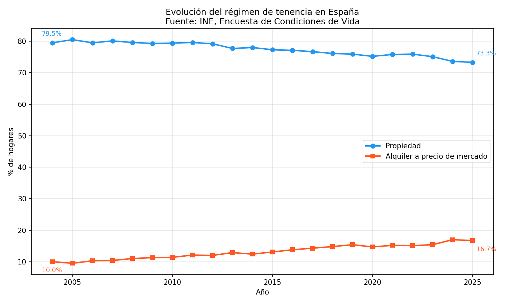

### 2.2 Tenencia por nivel de renta

La relación entre renta y tenencia es monotónica: a mayor renta, más propiedad
y menos alquiler. El decil 1 (renta más baja) tiene cuatro veces más inquilinos
que el decil 10:

| Decil | % propietarios | % alquiler mercado |
|---|---|---|
| D1 (más pobre) | 6,9% | 41,1% |
| D2 | 7,2% | 22,2% |
| D3 | 8,2% | 17,2% |
| D5 | 10,2% | 14,2% |
| D8 | 11,5% | 10,2% |
| D10 (más rico) | 12,0% | 8,5% |

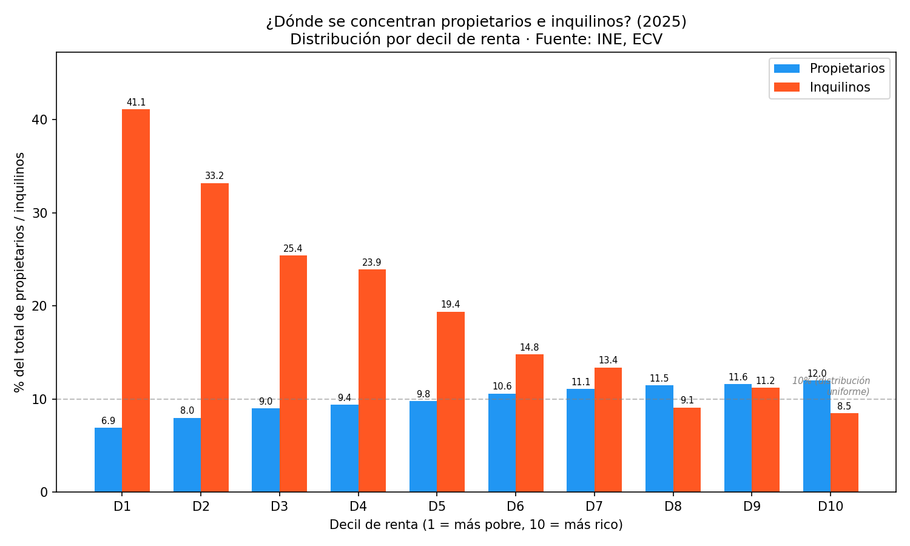

### 2.3 La fractura generacional

El dato más dramático del estudio. Los menores de 35 años han perdido 23 puntos
de tasa de propiedad en veinte años:

| Grupo de edad | 2002 | 2008 | 2022 |
|---|---|---|---|
| <35 años | 55,0% | 65,0% | **31,8%** |
| 35-44 | 72,0% | 75,0% | 61,8% |
| 45-54 | 80,0% | 82,0% | 71,8% |
| 65-74 | 87,0% | 88,0% | 83,0% |

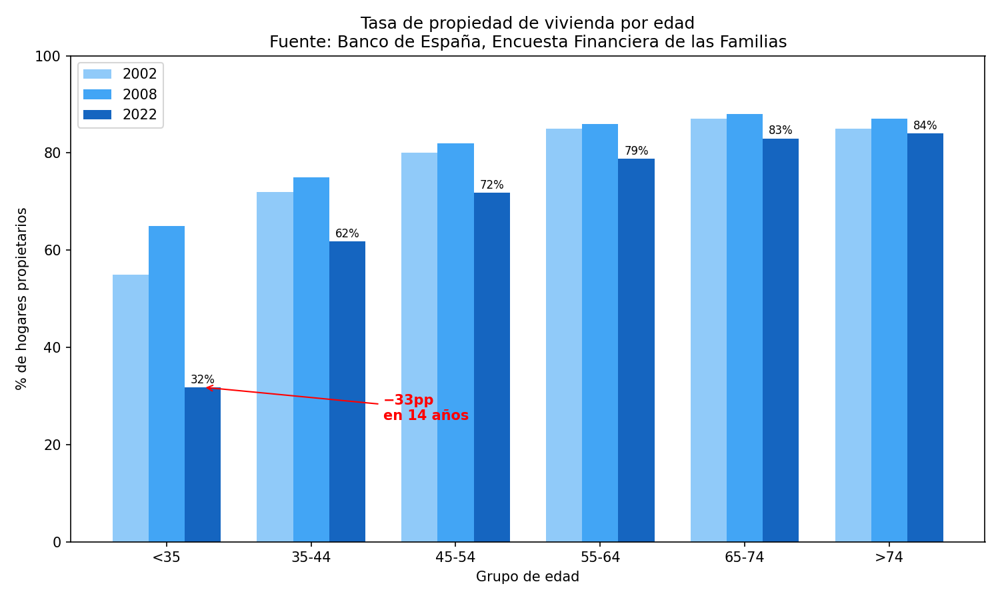

La burbuja inmobiliaria (1998-2008) permitió que muchos jóvenes accedieran a la
propiedad con créditos al 100% — el pico de 2008 fue artificial. Pero la caída
posterior no fue una simple corrección: los precios volvieron a subir sin que
los salarios siguieran. El resultado es una generación entera expulsada del
modelo patrimonial que definió a la clase media española.

### 2.4 Variación territorial

El alquiler no se distribuye uniformemente. Cataluña tiene casi el triple de
tasa de alquiler que Navarra:

- Mayor alquiler: Cataluña (23,2%), Baleares (21,0%), Madrid (20,5%)
- Menor alquiler: Navarra (8,8%), Extremadura (9,2%), Castilla y León (10,1%)

El patrón es claro: las comunidades con mayor presión turística y de precios
son las que más alquiler tienen. No por elección, sino por exclusión de la
propiedad.

---

## 3. La sobrecarga: quién paga el precio

### 3.1 Definición

EUROSTAT define **sobrecarga** (*housing cost overburden*) como destinar más del
40% de la renta disponible al coste de la vivienda (alquiler o hipoteca más
servicios asociados).

### 3.2 Resultados por decil

La sobrecarga se concentra brutalmente en las rentas más bajas:

| Decil | % hogares con sobrecarga | Coste vivienda como % renta |
|---|---|---|
| D1 | **51,2%** | **57,8%** |
| D2 | 20,6% | 32,1% |
| D3 | 11,6% | 25,4% |
| D5 | 2,9% | 18,6% |
| D10 | 0,1% | 7,3% |
| **Media España** | **9,9%** | — |

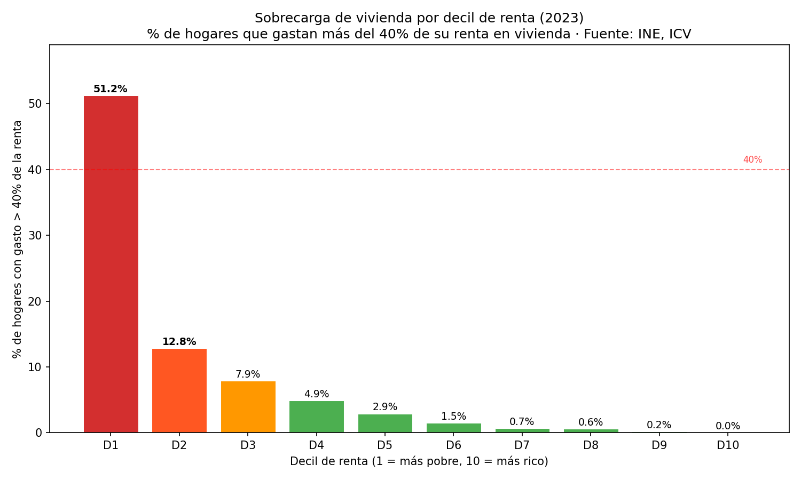

El ratio es demoledor: el D1 destina **8 veces** más proporción de su renta a
vivienda que el D10. La vivienda es, con diferencia, el mayor vector de
desigualdad de gasto en España.

### 3.3 Comparación europea

España duplica la tasa de sobrecarga de sus vecinos:

| País | Tasa de sobrecarga (2023) |
|---|---|
| España | **9,9%** |
| Grecia | 29,0% |
| Alemania | 5,7% |
| Francia | 4,2% |
| Italia | 7,3% |
| Media UE-27 | 8,7% |

España está por encima de la media europea, y muy lejos de Francia o Alemania.
Solo países con crisis de deuda más severas (Grecia) o mercados de alquiler
muy desregulados salen peor parados.

### 3.4 Evolución de los alquileres

Los alquileres medianos han subido un 33-46% desde su mínimo post-crisis (2015):

| CCAA | 2015 | 2023 | Variación |
|---|---|---|---|
| Baleares | 480€ | 700€ | **+46%** |
| C. Valenciana | 350€ | 500€ | +43% |
| Madrid | 570€ | 759€ | +33% |
| Cataluña | 500€ | 667€ | +33% |
| Andalucía | 400€ | 525€ | +31% |

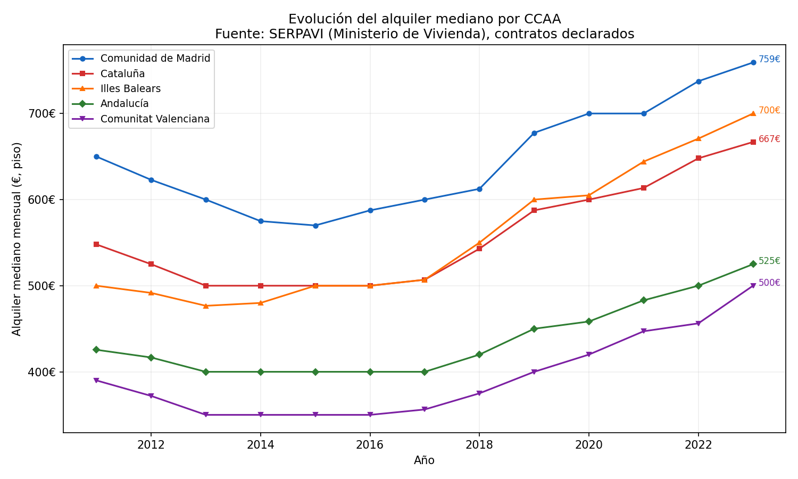

---

## 4. Concentración de la propiedad

### 4.1 El Catastro

El Catastro registra en 2024 unos **25,9 millones de titulares** de bienes
inmuebles urbanos (excluidas País Vasco y Navarra, que tienen régimen fiscal
propio). El 95,4% son personas físicas y el 2,4% personas jurídicas.

La distribución es muy asimétrica:

| Nº de inmuebles | Titulares | % del total |
|---|---|---|
| 1 | 12.522.967 | 48,4% |
| 2 | 5.794.559 | 22,4% |
| 3 | 3.071.061 | 11,9% |
| 4 | 1.714.724 | 6,6% |
| 5 | 960.283 | 3,7% |
| 6-10 | 1.460.040 | 5,6% |
| 11-25 | 318.093 | 1,2% |
| 26-50 | 30.290 | 0,1% |
| >50 | 13.843 | 0,05% |

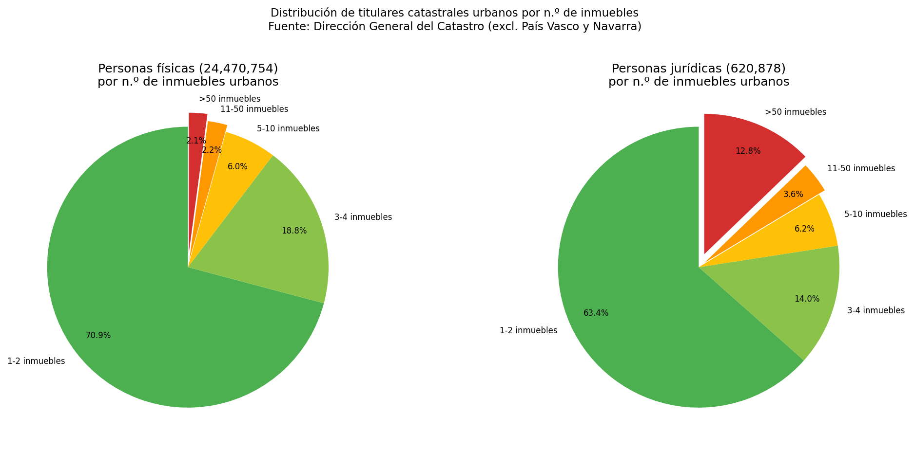

La mitad de los titulares posee un solo inmueble. El 93% posee 5 o menos.
En el otro extremo, **362.226 titulares** (el 1,4%) poseen más de 10 inmuebles
cada uno, acumulando un estimado de **7,9 millones de bienes inmuebles urbanos**
(el 12,3% del total). Y los 13.843 mega-tenedores (>50) poseen alrededor de
1 millón de inmuebles.

### 4.2 El umbral de "gran tenedor"

La Ley de Vivienda de 2023 define como "gran tenedor" a quien posea más de
10 inmuebles (5 en zonas tensionadas, según la CCAA). ¿Tiene este umbral
base estadística?

Para responderlo, calculamos la **densidad** (titulares por unidad de amplitud
del bracket) y medimos las caídas entre brackets consecutivos:

| Transición | Factor de caída |
|---|---|
| 4→5 | 1,8× |
| 5→6-10 | **3,3×** (quiebre moderado) |
| **6-10→11-25** | **13,8×** (acantilado) |
| 11-25→26-50 | 17,5× |
| 26-50→>50 | 4,4× |

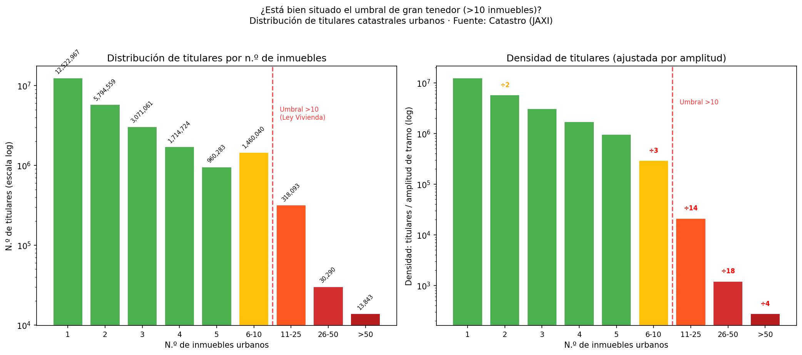

La caída de densidad de **13,8×** entre el bracket 6-10 y el bracket 11-25 es
la mayor ruptura estructural de toda la distribución. El umbral de 10 inmuebles
no es arbitrario: separa dos poblaciones estadísticamente distintas. Por debajo
hay 1,46 millones de "multipropiedad media" (6-10 inmuebles); por encima,
362.000 "grandes tenedores" — una ratio natural de 4:1 en la frontera.

El umbral de >5 (adoptado por Cataluña y otras CCAA para zonas tensionadas)
también tiene base: la caída de 3,3× es la primera ruptura significativa. En
mercados urbanos con alta presión, capturar este segmento adicional (que
multiplica por 5 el número de afectados) puede estar justificado.

**Variación provincial**: el umbral no funciona igual en todas partes. Las
provincias rurales (Ourense, Soria, León) tienen hasta 2,4% de titulares con
>10 inmuebles, mientras que las urbanas de Andalucía (Sevilla, Cádiz) tienen
solo 0,6%. Un umbral nacional uniforme puede ser demasiado estricto para áreas
rurales y demasiado laxo para mercados urbanos tensos.

---

## 5. ¿Hay oligopolio en el alquiler?

### 5.1 Metodología

Para estimar la cuota de mercado de los grandes tenedores en el alquiler,
cruzamos los datos del Catastro (titulares por número de inmuebles, por
provincia) con los del Censo 2021 (viviendas en alquiler, por provincia y
municipio).

El Catastro cuenta **bienes inmuebles urbanos**, que incluyen viviendas pero
también garajes, trasteros, locales comerciales y oficinas. Para estimar qué
fracción de los inmuebles de grandes tenedores son viviendas de alquiler,
calibramos con datos externos: según elDiario.es y el Banco de España, los
27.000 titulares con >10 inmuebles residenciales poseen 1.046.188 viviendas.
Esto implica que aproximadamente el 8% de los bienes inmuebles urbanos de
grandes tenedores están en el mercado de alquiler residencial.

### 5.2 Resultado nacional: no hay oligopolio

A nivel nacional, el mercado de alquiler está **fragmentado**:

| Segmento | Titulares | Cuota estimada del alquiler |
|---|---|---|
| >10 inmuebles | 362.226 | ~18% |
| >50 inmuebles | 13.843 | ~3% |
| Resto (<10) | 25,5M | ~82% |

Con millones de pequeños propietarios controlando más del 80% de la oferta,
no se puede hablar de oligopolio a nivel nacional. Ningún actor tiene poder
de fijación de precios en el mercado agregado.

### 5.3 Resultado local: sí hay oligopolio

Pero el mercado de alquiler es **local**. Un inquilino en Barcelona no sustituye
su vivienda por una en Zamora. Y a nivel de ciudad, la concentración es otra:

| Ciudad | Dato | Fuente |
|---|---|---|
| Barcelona | Grandes tenedores (>10) = **36% del alquiler** habitual | Ayuntamiento de Barcelona |
| Barcelona | 10 mayores arrendadores = 15% de todos los alquileres | INCASOL |
| Madrid | 10 mayores empresas = **12% de contratos** registrados | Civio / CNMV |
| Madrid (área metro) | Blackstone + Cerberus + Lazora ≈ 100.000 unidades | Estimaciones sectoriales |

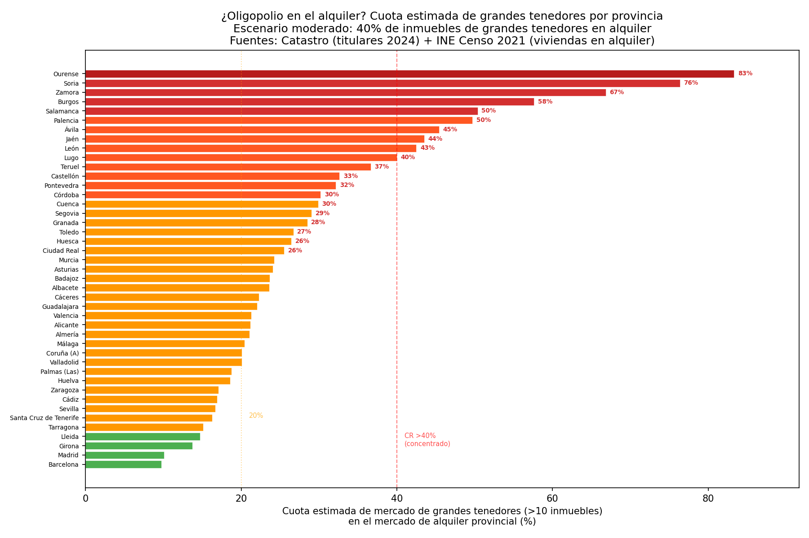

El oligopolio existe donde más presión de alquiler hay. En Barcelona, una
de cada tres viviendas de alquiler pertenece a un gran tenedor. En barrios
concretos (Raval, Poble-sec, Sant Martí), un solo SOCIMI puede controlar
el 20-50% de la oferta disponible.

### 5.4 El mecanismo

Los grandes tenedores no necesitan coludirse explícitamente para influir
en los precios. Cuatro factores lo hacen por ellos:

1. **Pricing algorítmico**: plataformas tipo RealPage analizan datos de mercado
   en tiempo real y recomiendan precios óptimos. Cuando múltiples propietarios
   usan el mismo algoritmo, los precios convergen al alza sin necesidad de
   acuerdo explícito.

2. **Retención de oferta**: mantener pisos vacíos puede ser racional si el
   coste de oportunidad (IBI, comunidad) es inferior a la revalorización
   esperada o al efecto sobre los precios del resto de la cartera.

3. **Asimetría informativa**: un fondo con 5.000 viviendas tiene datos de
   cartera (vacancia, rotación, precios de cierre) que un inquilino individual
   no puede ni aproximar.

4. **Costes de cambio**: mudarse tiene costes altos (fianza, agencia, mudanza,
   matrícula escolar). Un inquilino cautivo acepta subidas que un mercado
   competitivo no toleraría.

### 5.5 ¿Quiénes son los grandes tenedores?

Las investigaciones periodísticas de Civio y El Crítico (basadas en cruces de
datos de fianzas, registros de la propiedad y CNMV) han identificado a los
principales actores. No existe un registro público que agregue esta
información: el Registro de Grandes Tenedores de Cataluña (obligatorio desde
febrero de 2025) no publica datos nominativos.

**Los dos mayores "caseros" de España** (Civio, 2024):

| Entidad | Viviendas en alquiler | Tipo |
|---|---|---|
| **CaixaBank** (Buildingcenter) | ~22.000 | Banco español |
| **Blackstone** (27 filiales) | ~19.600 | Fondo de inversión (EEUU) |

**Top 10 en Cataluña** (El Crítico, datos INCASOL):

| # | Empresa | Viviendas | Tipo |
|---|---|---|---|
| 1 | CaixaBank (Buildingcenter) | 5.064 | Banco |
| 2 | Cerberus (Divarian) | 2.877 | Fondo distressed (EEUU) |
| 3 | Blackstone (Fidere, Testa) | 2.590 | Fondo distressed (EEUU) |
| 4 | Cevasa (familia Vaqué) | 2.191 | Patrimonialista local (desde 1945) |
| 5 | BBVA | 2.083 | Banco |
| 6 | Banc Sabadell | 2.035 | Banco |
| 7 | Azora / Nestar | 1.190 | Gestora española |

En **Madrid**, Blackstone es dominante: 13.125 viviendas, dos tercios de toda
la inversión extranjera en alquiler en la comunidad.

**¿Son "fondos buitre"?** No todos. La composición real del 36% de Barcelona es:

- **~⅓ fondos de inversión** que compraron activos a descuento de bancos
  rescatados durante la crisis 2008-2015 (Blackstone, Cerberus, Goldman Sachs,
  Ares, TPG). Estos sí encajan en la definición de "fondo buitre": adquirieron
  deuda distressed y activos inmobiliarios de cajas en quiebra a precios de
  saldo. Solo entre 2015 y 2019 compraron más de 148.500 millones de euros en
  carteras inmobiliarias de bancos españoles.
- **~⅓ bancos españoles** (CaixaBank, BBVA, Sabadell) que acumularon pisos
  procedentes de hipotecas que concedieron sin evaluar adecuadamente el
  riesgo de impago, fueron rescatados con fondos públicos, y retuvieron
  las viviendas ejecutadas en cartera.
- **~⅓ patrimonialistas locales** históricas (Cevasa desde 1945, Núñez i
  Navarro desde los años 50, familia Sanahuja). Estas empresas construyeron
  o compraron sus carteras a lo largo de décadas.

**Tendencia 2025-2026**: los fondos de la crisis están vendiendo. Blackstone
negocia la venta de Fidere (5.300 pisos en Madrid) a Brookfield por ~1.200M€.
La regulación del alquiler en zonas tensionadas y la inseguridad jurídica
percibida aceleran la desinversión. Los reemplazan inversores institucionales
de largo plazo (fondos de pensiones, aseguradoras). Las viviendas cambian de
manos, pero siguen concentradas.

### 5.6 SOCIMIs: historia y régimen fiscal

Las Sociedades Anónimas Cotizadas de Inversión Inmobiliaria (SOCIMIs) son la
versión española de los REITs (Real Estate Investment Trusts), creados en
EEUU en 1960. En 2025 hay unas 120 SOCIMIs activas con unos 46.000 millones
de euros en activos inmobiliarios.

**Historia legislativa:**

La Ley 11/2009, aprobada por el gobierno de Zapatero (PSOE), creó las SOCIMIs
con un régimen fiscal favorable (0% en Impuesto de Sociedades) pero con
requisitos tan estrictos que el vehículo resultó inviable:

| Requisito (Ley 2009) | Valor |
|---|---|
| Capital mínimo | 15 millones € |
| Nº mínimo de inmuebles | 3 |
| Diversificación | Máximo 40% en un solo activo |
| Apalancamiento | Máximo 70% deuda/activos |
| Permanencia mínima | 7 años |
| Cotización | Solo mercados regulados |

**Resultado: 0 SOCIMIs creadas entre 2009 y 2012.** La ley fue un fracaso
completo.

La Ley 16/2012, aprobada por el gobierno de Rajoy (PP), reformó el régimen
eliminando prácticamente todas las restricciones:

| Requisito | 2009 (Zapatero) | 2012 (Rajoy) |
|---|---|---|
| Capital mínimo | 15M € | **5M €** |
| Nº inmuebles | Mínimo 3 | **1 solo** |
| Diversificación | Máx. 40% por activo | **Sin límite** |
| Apalancamiento | Máx. 70% | **Sin límite** |
| Permanencia | 7 años | **3 años** |
| Cotización | Mercados regulados | **También MAB** |

El tipo del 0% en Sociedades ya estaba en la ley de 2009, pero las
restricciones la hacían inviable. La reforma de 2012 mantuvo el 0% y eliminó
las barreras. El resultado fue explosivo: de 0 a 90 SOCIMIs en seis años.

**De las ~120 SOCIMIs activas, solo unas 25 son residenciales**, gestionando
~25.000 viviendas en alquiler (0,7% del parque total). Las más grandes
están controladas por los mismos fondos: Testa (~9.000 viviendas, Blackstone),
Nestar (~9.500, CBRE/Azora), Fidere (~5.300, Blackstone → Brookfield).

El régimen del 0% en Sociedades ha sido objeto de debate recurrente. En
noviembre de 2024, el acuerdo de coalición PSOE-Sumar propuso eliminarlo y
aplicar el tipo general del 25%, pero la propuesta fue bloqueada en el
Congreso. El régimen sigue vigente a febrero de 2026.

### 5.7 ¿Cómo se creó la concentración? Antes y después de 2013

Antes de 2012, **no existía concentración institucional** en el alquiler
residencial español. El mercado estaba dominado de forma aplastante por
pequeños propietarios particulares (97-99% del total). No había equivalente
a los REITs anglosajones en vivienda residencial. La concentración se creó
en dos oleadas:

**Primera oleada (2008-2012): los bancos absorben ladrillo tóxico.** Al
estallar la burbuja, las cajas de ahorros se quedaron con promociones
enteras de constructoras quebradas. Entre 2008 y 2010, las sociedades
multipropietarias acapararon más del 50% de las nuevas altas catastrales
de inmuebles residenciales. Los bancos se convirtieron en grandes caseros
involuntarios.

**Segunda oleada (2013-2019): los bancos venden a fondos internacionales.**
Las ventas de vivienda pública a fondos abrieron la puerta:

| Operación | Viviendas | Precio | Comprador | Resultado |
|---|---|---|---|---|
| EMVS Madrid (Botella, 2013) | 1.860 | 128,5M€ | Blackstone | Revalorizadas a 1.011M€ en 4 años (×5) |
| IVIMA C. Madrid (I. González, 2013) | 2.935 | 201M€ | Goldman Sachs / Azora | **Anulada por el Tribunal Supremo** (2021) |
| SAREB (viviendas protegidas) | 9.440 | No revelado | Múltiples fondos | Civio recurre ante la Audiencia Nacional |

Pero el grueso de la transferencia no fueron viviendas públicas sino
**carteras bancarias**: la Operación Hércules (Blackstone compra 70.000
hipotecas de CatalunyaCaixa), la venta de Bankia Habitat a Cerberus
(12.200M€ en activos), las carteras de CaixaBank a Lone Star. Solo en
2013 se cerraron 35 macrooperaciones por 16.147 millones de euros.

**El impacto directo** de la venta de ~14.000 viviendas protegidas es
cuantitativamente modesto frente a 26 millones de viviendas. Pero el
efecto cualitativo fue desproporcionado:

- Las viviendas estaban concentradas en Madrid, donde el impacto sobre
  precios es máximo.
- Blackstone subió los alquileres de las viviendas de la EMVS un **49%
  entre 2015 y 2017**.
- Las ventas abrieron la puerta y legitimaron las macrooperaciones
  bancarias posteriores.
- Con solo un 1,5% de vivienda social (frente al 17% de Francia o el
  30% de Países Bajos), cada unidad pública vendida tiene un impacto
  relativo enorme.

**Evolución medible** (Catastro 2014 → 2024):

| Segmento | Variación |
|---|---|
| 1 inmueble | −1,78% |
| 2 inmuebles | +7,19% |
| 3-5 inmuebles | +12-24% |
| 6-10 inmuebles | **+30%** |
| >10 inmuebles (grandes tenedores) | +20% (de 255.000 a 307.000) |

La tendencia es clara: los pequeños propietarios pierden peso, los
medianos y grandes lo ganan. El número de grandes tenedores ha crecido
un 20% en una década, y el tramo de 6-10 inmuebles — justo por debajo
del umbral legal — es el que más crece.

---

## 6. La paradoja de las viviendas vacías

### 6.1 El gran número

El Censo 2021 del INE (tabla 59531) clasifica las viviendas según su consumo
eléctrico:

| Categoría | Viviendas | % del parque |
|---|---|---|
| En uso regular (>750 kWh/año) | 19.336.136 | 72,6% |
| **Vacías** (consumo <15 días equiv.) | **3.828.307** | **14,4%** |
| Uso esporádico (251-750 kWh) | 2.517.628 | 9,5% |
| Bajo consumo (<250 kWh) | 941.637 | 3,5% |
| **Total** | **26.623.708** | **100%** |

España tiene **más viviendas vacías que viviendas en alquiler** (3,83M vs. 2,98M).
El parque vacío equivale a 43 años de construcción nueva al ritmo actual
(~90.000 viviendas/año).

### 6.2 El desajuste geográfico

Pero el número engaña. Las viviendas vacías no están donde la gente las necesita:

| Tipo de zona | % vacías | Ejemplo |
|---|---|---|
| Rural vaciado | 25-44% | Ourense 43,7%, Lugo 37,3% |
| Interior estancado | 15-25% | Ciudad Real 29,1%, Teruel 26,3% |
| Costa turística | 15-25% | Torrevieja 24,9%, Marbella 20,2% |
| Urbano dinámico | 6-12% | Madrid 6,3%, Barcelona 9,3% |

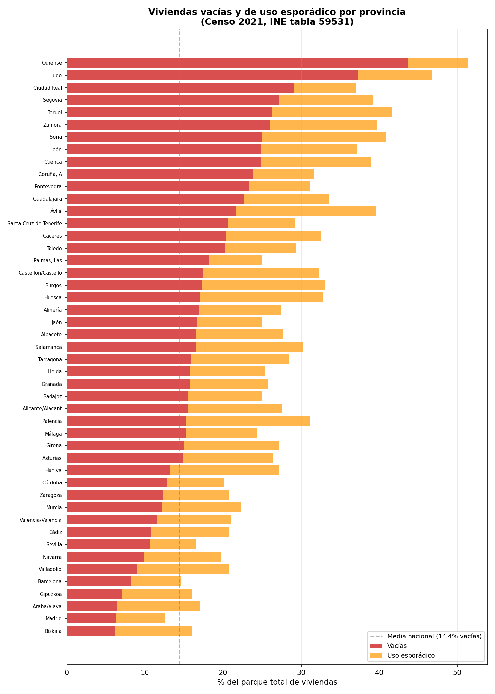

El **31% de todas las viviendas vacías** de España se concentra en 16 provincias
con más del 20% de vacancia — la España vaciada. Solo el 14% está en las 7
provincias con mercados de alta presión (<10% de vacancia).

### 6.3 La paradoja provincia a provincia

¿Hay más vacías donde hay más alquiler? No necesariamente. Las provincias con
mayor tasa de vacancia son las que tienen menos alquiler (rural), mientras que
las de mercados tensionados (Madrid, Barcelona, Bizkaia) tienen pocas vacías:

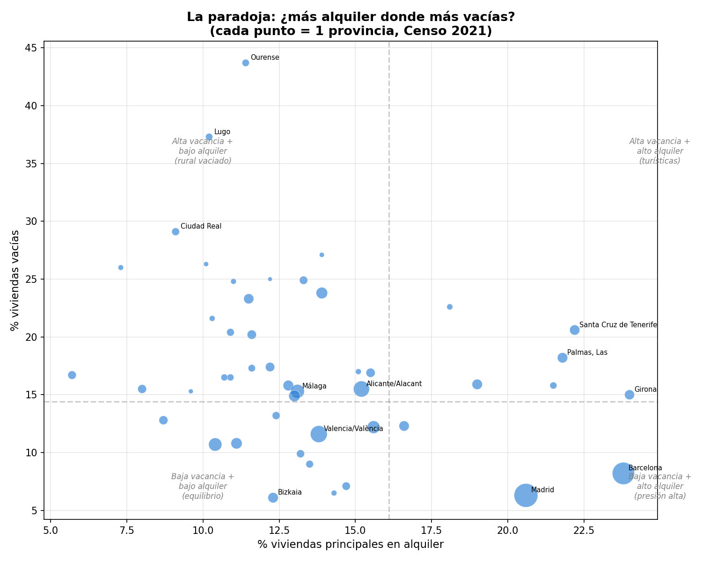

Las provincias más paradójicas son las turísticas: Santa Cruz de Tenerife
(20,6% vacías + 22,2% alquiler), Girona (15,0% + 24,0%), Las Palmas
(18,2% + 21,8%). Aquí las "vacías" son en gran parte viviendas estacionales
que reducen la oferta de alquiler permanente sin estar realmente desocupadas.

### 6.4 Las grandes ciudades

En las ciudades donde más presión hay, el stock vacío es significativo pero
limitado comparado con el mercado de alquiler:

| Ciudad | Vacías | % vacías | En alquiler | Ratio vacías/alquiler |
|---|---|---|---|---|
| Madrid | 96.921 | 6,3% | 317.766 | 0,3× |
| Barcelona | 75.488 | 9,3% | 208.468 | 0,4× |
| València | 36.321 | 8,8% | 55.865 | 0,7× |
| Sevilla | 24.621 | 7,5% | 37.015 | 0,7× |
| Palma | 9.187 | 4,9% | 39.403 | 0,2× |

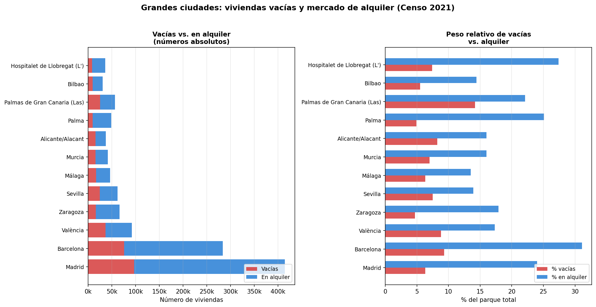

Madrid tiene casi 97.000 viviendas vacías según el INE, pero recordemos la
nota metodológica: la cifra real de genuinamente desocupadas puede ser muy
inferior. Aun así, incluso la cifra del INE supone solo 0,3 viviendas vacías
por cada vivienda en alquiler — no es un stock que transforme el mercado
por sí solo.

### 6.5 ¿Qué pasaría si se movilizaran?

Supongamos que una política eficaz (incentivos fiscales, penalizaciones)
consiguiera poner en el mercado de alquiler una fracción de las vacías:

| Escenario | Viviendas movilizadas | Aumento de la oferta de alquiler |
|---|---|---|
| 5% (incentivos suaves) | +191.415 | +6,4% |
| 10% (política moderada) | +382.830 | +12,8% |
| 25% (regulación fuerte) | +957.076 | +32,1% |

Un 25% de movilización — escenario ambicioso — supondría casi un millón de
viviendas nuevas en el mercado de alquiler. Pero incluso eso solo cubriría
una sexta parte del déficit estimado de 600.000 viviendas en zonas de alta
demanda, porque la mayoría de las vacías movilizadas estarían en zonas sin
presión.

En las grandes ciudades, los números son más modestos pero relevantes:
movilizar el 25% de las vacías supondría +8% de oferta en Madrid, +9% en
Barcelona y +20% en Las Palmas.

---

## 7. El círculo vicioso

Los hallazgos de este estudio se retroalimentan:

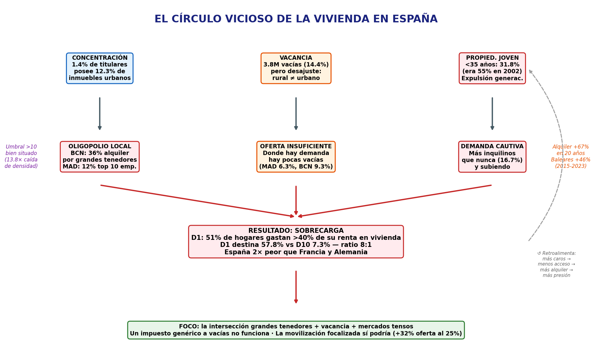

1. La **concentración de propiedad** (1,4% de titulares posee el 12,3% de
   inmuebles urbanos) genera poder de mercado en ciudades concretas.

2. El **oligopolio local** (Barcelona 36%, Madrid 12%) permite a los grandes
   tenedores mantener precios altos e incluso retener oferta (pisos vacíos
   estratégicos).

3. Los **precios altos** expulsan a los jóvenes de la propiedad (31,8% vs.
   55% hace veinte años), creando una masa creciente de inquilinos cautivos.

4. **Más demanda** de alquiler con oferta limitada → más presión sobre precios
   → más sobrecarga para las rentas más bajas.

5. Las **viviendas vacías** (3,8M) son una reserva teórica, pero están donde
   no hay demanda. Las que están en mercados tensos son insuficientes.

6. **Resultado**: el D1 destina 8 veces más proporción de su renta a vivienda
   que el D10. La vivienda es el mayor vector de desigualdad de gasto en España.

---

## 8. Cuadro resumen

| Indicador | Valor |
|---|---|
| Propiedad nacional (2023) | 73,3% (↓6,2pp desde 2008) |
| Alquiler de mercado (2023) | 16,7% (↑6,7pp desde 2004) |
| Propiedad jóvenes <35 (2022) | 31,8% (↓23pp desde 2002) |
| Sobrecarga D1 (>40% renta) | 51,2% de hogares |
| Coste vivienda D1 vs D10 | 57,8% vs 7,3% de la renta |
| Parque total de viviendas | 26,6 millones |
| Viviendas vacías (INE, cota superior) | 3,83M (14,4%) |
| Sin uso regular | 7,29M (27,4%) |
| Titulares de inmuebles urbanos | 25,9 millones |
| Grandes tenedores (>10 inmuebles) | 362.226 (1,4%) |
| Inmuebles de grandes tenedores | 7,9M (12,3% del parque urbano) |
| Gini de propiedad (entre titulares) | 0,435 |
| Caída de densidad en el umbral >10 | 13,8× (mayor del sistema) |
| Cuota grandes tenedores BCN | 36% del alquiler |
| Cuota top 10 empresas MAD | 12% del alquiler |
| SOCIMIs activas | 157, capitalización 31.000M€ |
| Alquiler mediano Madrid (2023) | 759€/mes |
| Subida alquiler Baleares (2015-2023) | +46% |

---

## 9. Conclusiones

### 9.1 España tiene suficientes viviendas — están mal repartidas

El país tiene 26,6 millones de viviendas para 19,5 millones de hogares. El
problema no es de stock total sino de distribución: geográfica (las vacías
están donde no hay demanda), económica (los que más necesitan no pueden pagar)
y generacional (los jóvenes están excluidos del acceso).

### 9.2 El "gran tenedor" está bien definido

El umbral de >10 inmuebles coincide con la mayor ruptura estadística de la
distribución de propiedad (caída de densidad de 13,8×). No es arbitrario.
El umbral de >5, adoptado por algunas CCAA para zonas tensionadas, tiene
también respaldo en los datos (primera ruptura significativa, 3,3×).

### 9.3 Hay oligopolio, pero local

A nivel nacional el mercado de alquiler está fragmentado. Pero en Barcelona
y Madrid, grandes tenedores institucionales (SOCIMIs, fondos) controlan cuotas
del 12-36%, suficientes para influir en precios. El mecanismo no requiere
colusión: pricing algorítmico y retención de oferta bastan.

### 9.4 El mito de las viviendas vacías

Las 3,83 millones de viviendas vacías del INE son una cifra inflada (la
metodología sobreestima hasta 10×) y, sobre todo, geográficamente desajustada.
No son la solución a la crisis de vivienda. Pero en mercados tensos concretos,
una movilización focalizada (incentivos al alquiler de unidades vacías en BCN,
MAD, Baleares) podría aportar un alivio parcial del 8-20% de oferta adicional.

### 9.5 Implicaciones para la política

1. **Un impuesto genérico a viviendas vacías** no funciona: la mayoría están
   donde nadie quiere vivir. Las políticas deben ser focalizadas por territorio.

2. **Regular el poder local** de grandes tenedores: transparencia en pricing
   algorítmico, penalizaciones a la vacancia estratégica en mercados tensos,
   límites a la concentración en zonas de alta presión.

3. **El régimen fiscal de las SOCIMIs** (0% en Sociedades) subsidia la
   concentración institucional de vivienda de alquiler. Merece revisión.

4. **La crisis es de distribución, no de construcción**: construir más sin
   abordar la concentración y el poder de mercado local no resolverá la
   sobrecarga del D1.

---

## 10. Limitaciones

- Los datos del **Catastro** cuentan bienes inmuebles urbanos, no solo
  viviendas. La conversión a viviendas de alquiler requiere calibración
  con fuentes externas (fracción estimada del 8%).
- La cifra de **viviendas vacías del INE** es una cota superior. Los datos
  de consumo eléctrico de 2020 (pandemia) pueden estar sesgados al alza.
- Las **cuotas de oligopolio por ciudad** (Barcelona 36%, Madrid 12%)
  provienen de fuentes municipales e investigaciones periodísticas, no de
  un registro centralizado y exhaustivo.
- No se han analizado los **precios de transacción** del alquiler (solo
  medianas por CCAA), ni las series temporales de precios por barrio.
- Los datos de **tenencia por decil** (ECV) y **propiedad por edad** (EFF)
  provienen de encuestas con tamaños muestrales limitados en las colas
  de la distribución.

---

## 11. Referencias

1. INE (2024). *Encuesta de Condiciones de Vida (ECV) 2004-2023*.
   Régimen de tenencia y coste de la vivienda por decil, CCAA y tamaño
   de municipio.
   [(Web)](https://www.ine.es/dyngs/INEbase/operacion.htm?c=Estadistica_C&cid=1254736176807&menu=resultados&idp=1254735976608)
2. INE (2024). *Censo de Población y Viviendas 2021*. Tablas 59520-59531.
   Viviendas según tipo, tenencia, intensidad de uso, por provincia y
   municipio.
   [(Web)](https://www.ine.es/dyngs/INEbase/operacion.htm?c=Estadistica_C&cid=1254736177108&menu=resultados&idp=1254735572981)
3. Banco de España (2024). *Encuesta Financiera de las Familias (EFF) 2022:
   métodos, resultados y cambios desde 2020*. Documento Ocasional 2413.
   [(PDF)](https://www.bde.es/f/webbe/SES/Secciones/Publicaciones/PublicacionesSeriadas/DocumentosOcasionales/24/Fich/do2413.pdf)
4. Dirección General del Catastro (2024). *Estadística catastral: titulares
   de bienes inmuebles urbanos por número de bienes*, datos provinciales
   2024 (9 brackets), visor JAXI/PC-Axis.
   [(Web)](https://www.catastro.hacienda.gob.es/jaxi/tabla.do)
5. EUROSTAT (2024). *EU Statistics on Income and Living Conditions
   (EU-SILC/ECEPOV)*. Housing cost overburden rate by income quintile.
   [(Web)](https://ec.europa.eu/eurostat/databrowser/view/ilc_lvho07a)
6. Ley 12/2023, de 24 de mayo, por el derecho a la vivienda.
   [(BOE)](https://www.boe.es/buscar/act.php?id=BOE-A-2023-12203)
7. Ajuntament de Barcelona (2023). *Informe sobre grans tenidors
   d'habitatges a Barcelona*.
8. Civio (2024). *¿Quién es quién en el alquiler en Madrid?
   Las empresas que controlan el mercado*.
   [(Web)](https://civio.es/)
9. elDiario.es (2024). *Los grandes tenedores de vivienda en España:
   cifras del Catastro y el Censo 2021*.
10. Conde-Ruiz, J.I. y García-Rodríguez, F. (2025). *Evolución de la
    Riqueza de las Familias en España (2002-2022)*. FEDEA eee2025-23.
    [(PDF)](https://documentos.fedea.net/pubs/eee/2025/eee2025-23.pdf)
